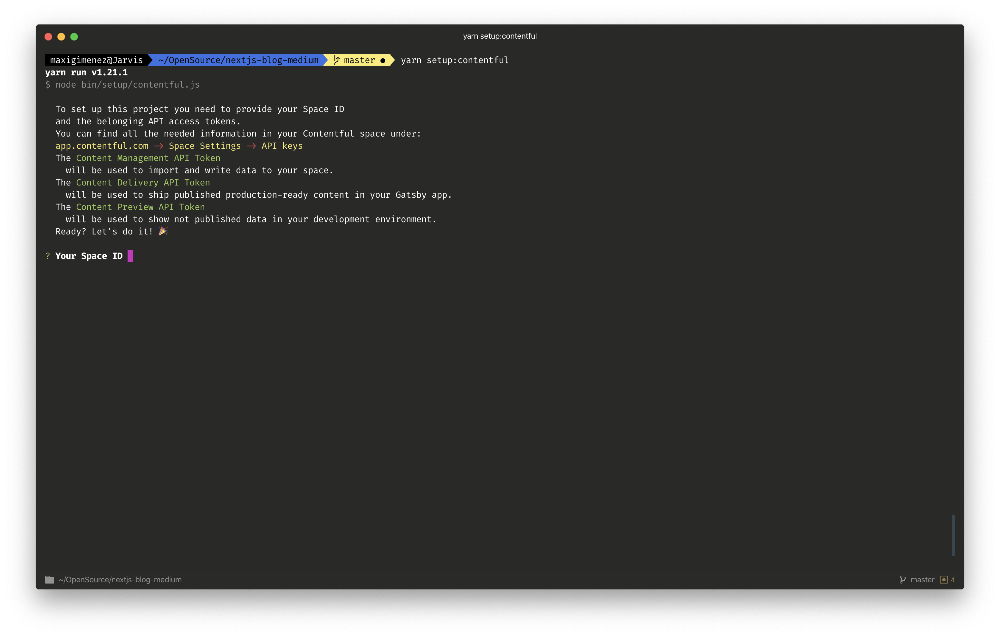

# Next.js Medium style boilerplate blog

> This is a [Next.js](https://nextjs.org/) project bootstrapped with [`create-next-app`](https://github.com/zeit/next.js/tree/canary/packages/create-next-app).

## Data Sources

This project has been designed to support any data source, under the `core/` folder you can find the models and service structure.

### Contentful

Contentful is the default integration supported at the moment, we also provided a setup script together with a schema to easily get it up and running.

## Template

This project uses [Mudana](https://www.wowthemes.net/mundana-free-html-bootstrap-template/) to achieve the medium style blog.

## Getting Started

### Install dependencies

```
$ git@github.com:maxigimenez/next-medium-blog-boilerplate.git
$ yarn install
```

### Setup models

#### Contentful

This projects comes with a Contentful schema ready to be used. Using `yarn setup:contentful`:



This command will ask you for a space ID, and access tokens for the Contentful Management and Delivery API and then import the schema defined on "schemas/contentful.json".

Once the script is done you will be able to launch the blog and see dummy information ready to be changed.

## Scripts

### `yarn dev`

Run the project locally. Then open [http://localhost:3000](http://localhost:3000) with your browser to see the result.

## Deploy

The repository comes with a simple `now.json` configuration, so we recommend to use [Zeit.co](https://zeit.co) to host the blog.
